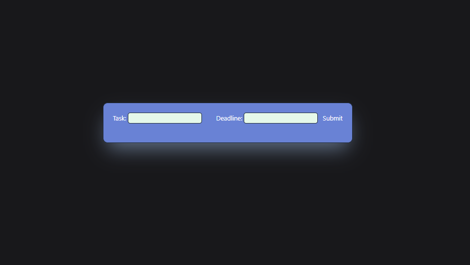
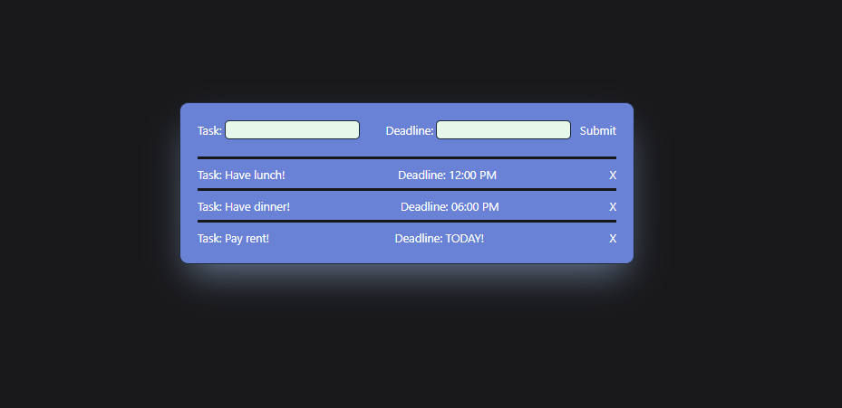
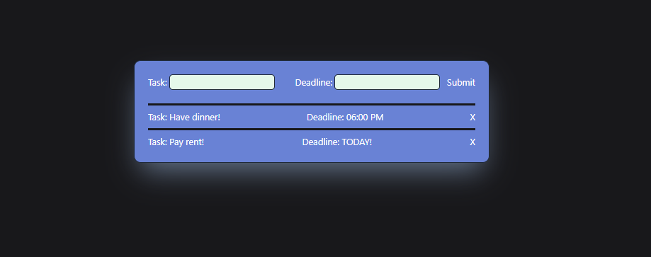

# Todo-App

## Description

Todo list build in react that lets the user write down tasks and deadlines.
Completely useless since it`s not connected to the local storage or the server, so all of the info 
disappears on save! 😁

## Table of Contents
- [Installation](#installation)
- [Usage](#usage)
- [Credits](#credits)
- [License](#license)
- [Collaborators](#Collaborators)

## Installation
Current project has been saved in my personal GitHub repository and is currently available for cloning and reviews on:

https://github.com/Valllerian/Todo-List-App

## Usage

Access the deployed app on: 

...link

Main page of the app.

 

 

1 ticked is pulled with no winning numbers.

 

 

3 tickets are pulled (man) with 1 winning number.

 

 

## Credits

Talwind instalation guide: 
 
https://tailwindcss.com/docs/guides/create-react-app

Talwind box-shadow property documentation:
 
https://tailwindcss.com/docs/box-shadow

## License
Current project is unlicensed. Which means - "Anyone is free to copy, modify, publish, use, compile, sell, or
distribute this software, either in source code form or as a compiled
binary, for any purpose, commercial or non-commercial, and by any
means." (Quote for source #3)

## Collaborators:

Valerii Bihun: valeriibihun.co@gmail.com;
